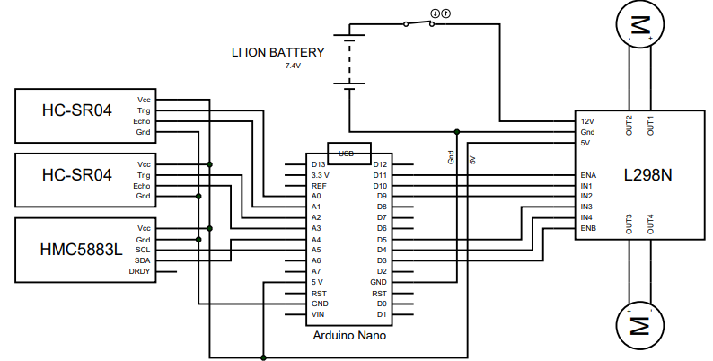
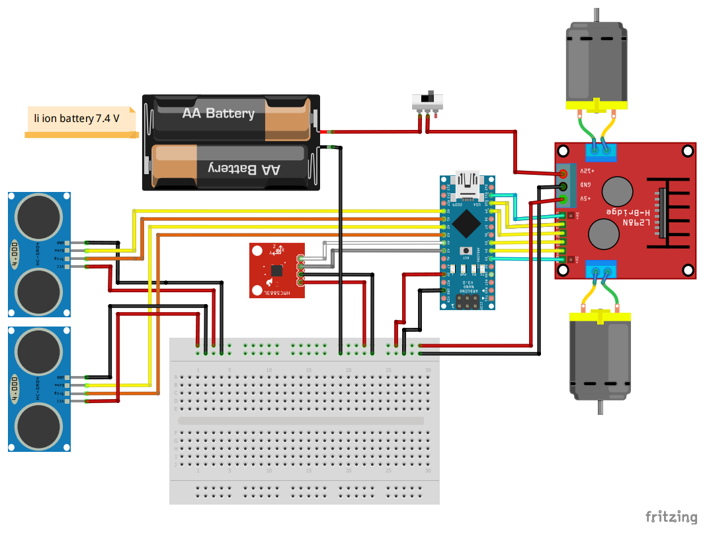

# Mobile-robot
This repositories contain the code implementation for Mobile Robotic assignment required for Autonomous Mobile Robotic(MKEM1883) course. It consist of code implementation using 3 different mechanism namely action-selection,priority-based and voting mechanism.

### Table Of Content

| No. | Content         |
|-----|-----------------|
| 1   | [Robot Objective](#robot-objective) |
| 2   | Robot Schematic |
| 3.  | Robot Mechanism |

### Robot Objective

The mobile robot is located at a random
starting position. The mobile robot needs
to move toward NORTH direction from
its starting position. There are two
obstacles along the path. The mobile
robot should be able to avoid these
obstacles while maintaining its NORTH
direction.

### Robot Schematic

schematic diagram 1:

schematic diagram 2 :

### Robot Mechanism
1. [Priority Based](./mechanism/priority-based)
2. [Action-Selection](./mechanism/action-selection)
3. [Voting](./mechanism/voting)
